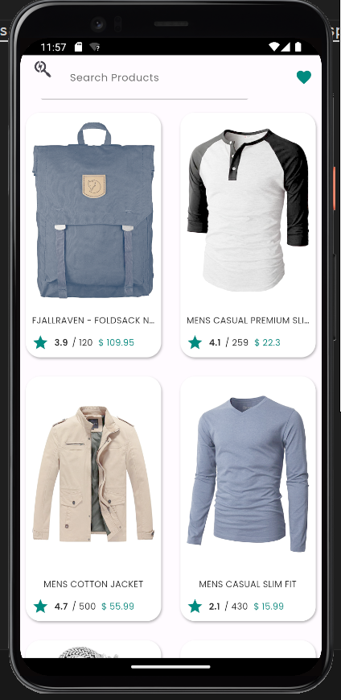
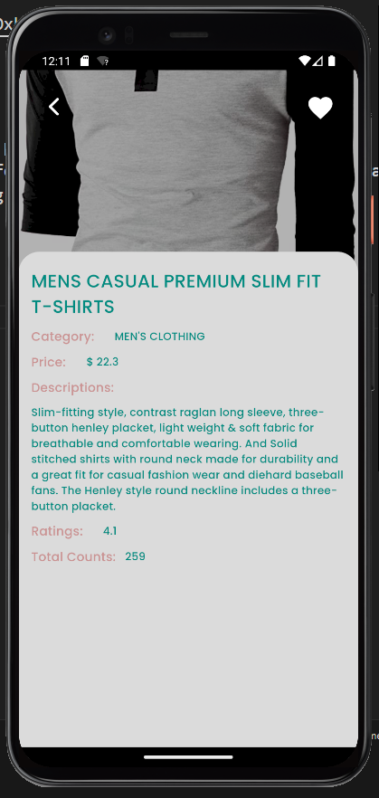
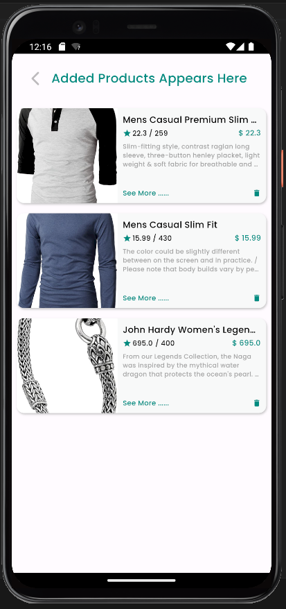

Link to download application: https://drive.google.com/drive/folders/1GqQwceID-dJrOxksdf6SoyHdcseQyJ7r?usp=sharing

In this code, the ProductScreen is a StatefulWidget that displays a list of products. It initializes the ProductServices to fetch product data and updates the productsController with the fetched products. The screen includes a search bar which searched the product using the title and gives the result, a favorites icon to view the cart, and a grid of product items. Tapping on a product item navigates to its details screen. The search bar filters the products based on the entered text.

In this code, the ProductDetailsScreen is a StatelessWidget that displays the details of a product. It shows the product image, title, category, price, description, ratings, and total votes. The screen includes a back button, an "Add to Cart" button, and a background image. When the "Add to Cart" button is pressed, the product is added to the cart using the Carts class.

In this code, the CartScreen is a StatefulWidget that displays the products added to the cart. It retrieves the cart items using the getCarts method from the Carts class and updates the UI using productsController. The screen includes a back button and a list of CustomizedCart widgets to show each cart item. Users can delete cart items by tapping the delete button, which triggers the deleteCartItem method from the Carts class. If the cart is empty, a message and an illustration are displayed.

